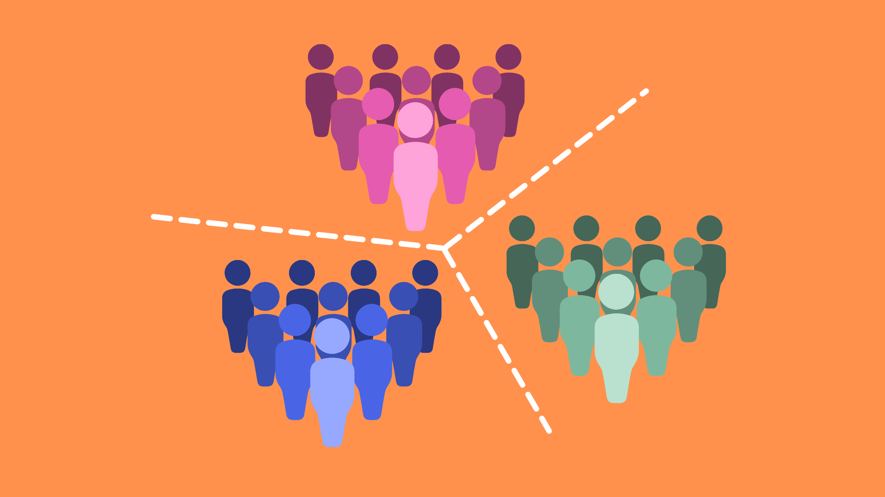
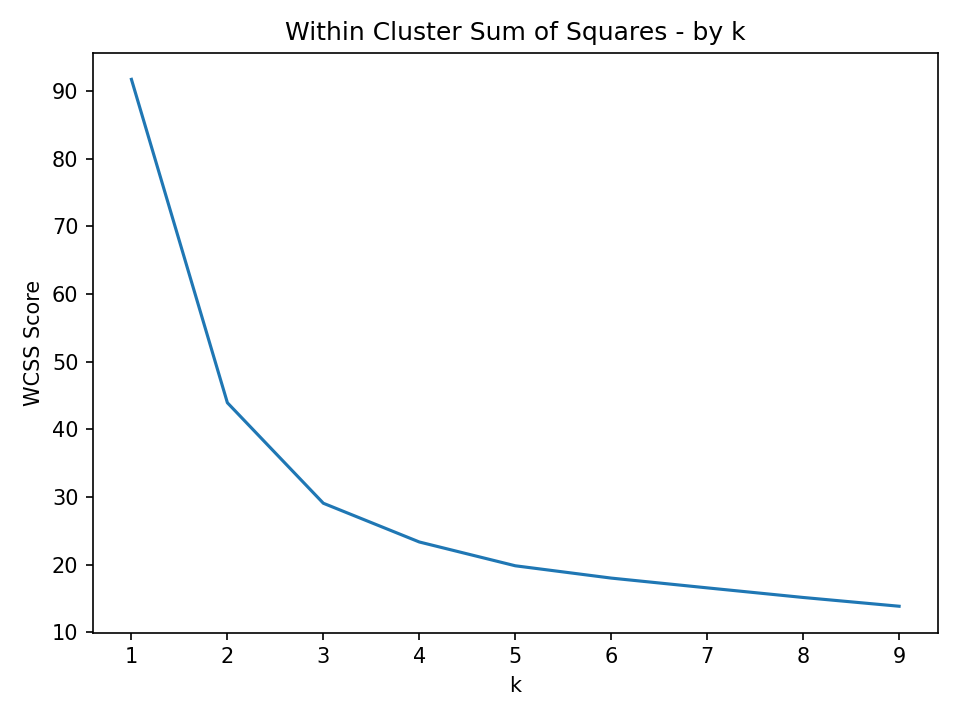

# The "You Are What You Eat" Customer Segmentation

**Author**: [Ruthy Yao](mailto:zejia.yao@gmail.com)

## Overview

ABC Grocery Store has accumulated large amount of data from customers' day-to-day shopping. The wealth of the data could render the leadership team invaluable insights into their customers. 

This project provides a customer segmentation based on the relative weight of the customer's spend across the product categories. Applying the Kmeans Clustering algorithm, we grouped the customers into three segments. The leadership team can use this segmentatiion to optimize their campaign and promotional offering, improve the inventory planning and drive more sales.  

## Business Problem

ABC Grocery Store's transactions data shows that their customers have a fair bit of spread of spending across different product areas. The management team would like to know whether the difference is just due to the size of their households or is driven by their lifestyle. The management team asked the data analytics team to dig into the data to see if there is any distinct clusters of their customer base. If so, we can rely on these insights to customize our communication on product recommendation and promotions, as well as optimize our inventory.

## Data and Methods

We have a transactions datatable with over 38,000 pieces of transaction data. Each line of the transaction data has the customer ID, the product categroy ID, quanities bought, sales value and profit margin. By mapping it with the product_area table we will be able to identify the product area for each transaction. 

I will aggregate the sale data by product area at customer level and convert the dollar value of the sales to the percentage sales of each product area to the total sales of each transaction. I will then use the K-Means Clustering algorithm to partitions the data-points into distinct groups (clusters) based upon their "similarity" to each other. The "similarity" is determined by the distance between the data points and a random point(known as centroid) in the n-dimensional space. This distance is called "euclidean distance". Each centroid is repositioned to the "mean" dimension values of it's cluster and each data-point is reassigned to the nearest centroid. This process is iterated until no data-points are reassigned to a closer centroid.

To determine the number of clusters that we want to split our data into, I use the "Within Cluster Sum of Squares (WCSS)" approach which measures the sum of the squared euclidean distances that data points lie from their closest centroid. I will test multiple values for k, and plot how this WCSS metric changes. I chose the k value where the decrease in WCSS score is quite marginal, meaning there is minimal extra benefit from creating one more cluster. 


## Results and Insights

Using the Elbow Curve Method, I decided to split the customers into three clusters.




Here is the cluster summary. 

| cluster |    Dairy |    Fruit |     Meat | Vegetables |
|--------:|---------:|---------:|---------:|------------|
|       1 | 0.220875 | 0.264605 | 0.376508 |   0.138011 |
|       2 | 0.002382 | 0.637796 | 0.003696 |   0.356126 |
|       3 | 0.363948 | 0.394152 | 0.029210 |   0.212690 |

* **Cluster 1**  - Customers have relatively balanced spend across the product areas with "Meat" the highest proportion of their shopping basket.
* **Cluster 2** - Customers barely spent any in "Diary" and "Meat" categories. Almost all of their shopping baskets are "Fruit" and "Vegetables". This indicates that they might be "Vegetarian Shoppers".
* **Cluster 3** - Customers spend mainly on "Dairy", "Fruit" and "Vegetables", with only 3% on "Meat". Let's call them "Lacto-vegetarian".
<br>
  
Below table compares the customer visit and spending between three clusters.

| **cluster** | **visit_count** | **Annual_spend** | **basket** |
|------------:|----------------:|-----------------:|------------|
|           1 |        6.212500 |      1982.184625 |  26.588660 |
|           2 |        4.446602 |      1402.195534 |  26.278410 |
|           3 |        5.404199 |      1513.168819 |  23.333225 |

We can see that Cluster 1 customers have the most frequent visits to the store hence the largest annual spends. Whereas Cluster 2 customer visit less than the other two groups. Cluster 3 customers' average spend per visit is smaller than the other two groups.
 
## Applications

Based upon these clusters, ABC Grocery will be able to target customers more accurately - promoting products & discounts to customers that are truly relevant to them - overall enabling a more customer focused communication strategy.

The visits and shopping basket analysis indicates that there is opportunity to increase the visit frequency from the cluster 2 "Vegetarian Shoppers". For example, ABC Grocery could send more seasonal promotions to attract more store visits. There is also opportunity to expand the shopping basket in cluster 3 "Lacto- vegetarian" shoppers. For instance, ABC could consider increasing the range of the products for these categories, so customers have more product choices for them to add to their basket.

### Next Steps

Further analysis will yield addtional insights on the customer segments.

* **Run the analysis on sub-categories to gain more granular understanding of the dietary preference** -  It would be interesting to run this clustering / segmentation at a lower level of product areas, so rather than just the four areas of Meet, Diary, Fruit and Vegetables, clustering spend across the sub-categories. This would mean we could create more specific clusters, and get an even more granular understanding of dietary preferences within the customer base.

* **Include other customer metrics to gain a more well-rounded customer segmentation** - Here we've just focused on variables that are linked directly to sales - it could be interesting to also include customer metrics such as income, house hold size, gender etc to give a even more well-rounded customer segmentation. 


## For More Information

See the full analysis in the [Jupyter Notebook](./customer_segmentation_notebook.ipynb) or review this [presentation](./customer_segmentation_presentation.pdf).

For additional info, contact Ruthy Yao at [zejia.yao@gmail.com](mailto:zejia.yao@gmail.com)

## Repository Structure

```
├── Data
│   └── grocery database.csv
├── images
├── customer_segmentation_notebook.ipynb 
├── customer_segmentation_presentation.pdf
└── README.md
```
# House_valuation_tool
